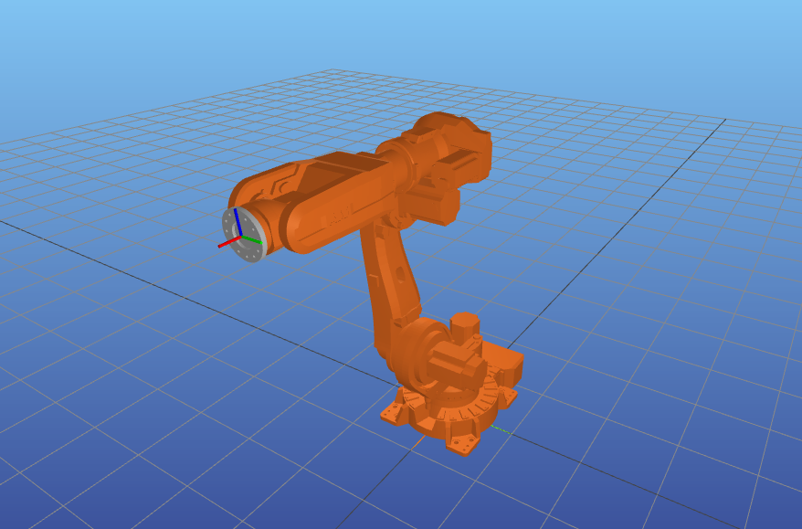
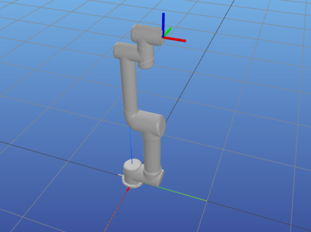
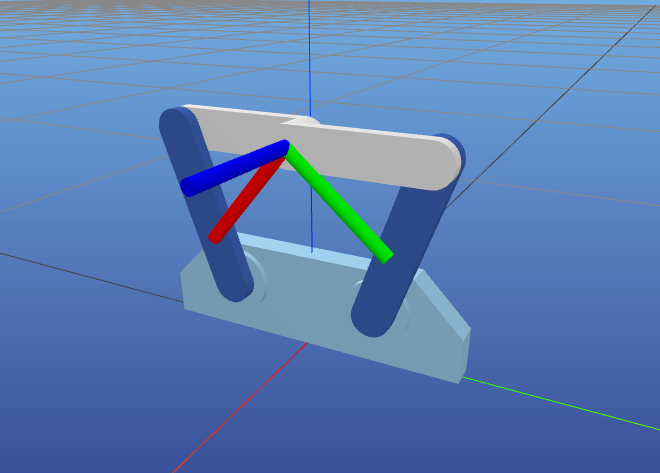
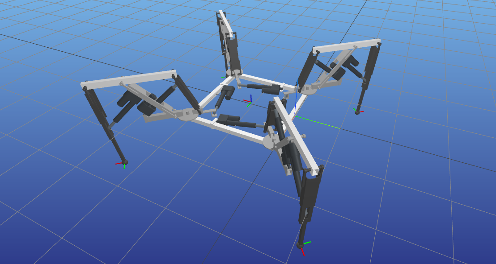
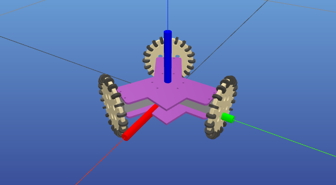
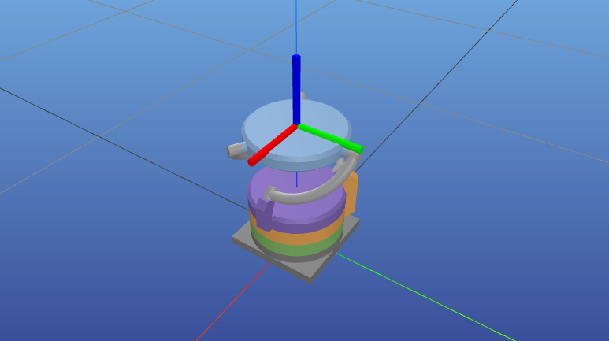
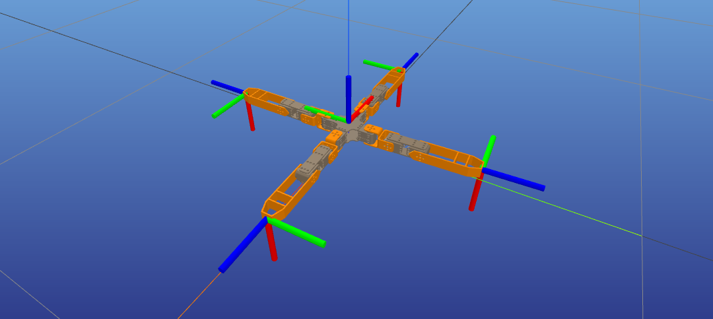

# PlaCo examples robot models

## 6axis

* **Description**: IRB6620 6-axis industrial robot
* **Joints**:
    * **Actuated**: Revolute joints (6)
        * `j1`, `j2`, `j3`, `j4`, `j5`, `j6`
* **Frames**:
    * `effector`: effector frame

## 6axis (UR5)

* **Description**: UR5 6-axis industrial robot
* **Joints**:
    * **Actuated**: Revolute joints (6)
        * `shoulder_pan_joint`, `shoulder_lift_joint`, `elbow_joint`, `wrist_1_joint`, `wrist_2_joint`, `wrist_3_joint`
* **Frames**:
    * `world`: base of the robot
    * `ee_link`: effector  frame

## Planar 2DoF

* **Description**: Planar 2 DoF robot
* **Joints**
    * **Actuated**: Revolute joints (2)
        * `motor1`, `motor2`
    * **Passive**: Revolute joints (2)
        * `passive1`, `passive2`
* **Frames**:
    * `effector`: effector frame
    * Closure constraint frame:
        * `closing_effector_1`, `closing_effector_2`

## Megabot

* **Description**: Megabot quadruped robot
* **Joints**
    * **Actuated**: Prismatic joints (3 per leg)
        * `l1_c1`, `l1_c2`, `l1_c3`
        * `l2_c1`, `l2_c2`, `l2_c3`
        * `l3_c1`, `l3_c2`, `l3_c3`
        * `l4_c1`, `l4_c2`, `l4_c3`
    * **Passive**: Revolute joints (8 per leg)
        * `l1_r1`, `l1_r2`, `l1_r3`, `l1_r4`, `l1_r5`, `l1_r6`, `l1_r7`, `l1_r8`
        * `l2_r1`, `l2_r2`, `l2_r3`, `l2_r4`, `l2_r5`, `l2_r6`, `l2_r7`, `l2_r8`
        * `l3_r1`, `l3_r2`, `l3_r3`, `l3_r4`, `l3_r5`, `l3_r6`, `l3_r7`, `l3_r8`
        * `l4_r1`, `l4_r2`, `l4_r3`, `l4_r4`, `l4_r5`, `l4_r6`, `l4_r7`, `l4_r8`
* **Frames**:
    * `base`: body trunk
    * `leg_1`, `leg_2`, `leg_3`, `leg_4`: leg tips
    * Closure constraint frames (4 per leg)
        * `l1_cl1_1`, `l1_cl1_2`, `l1_cl2_1`, `l1_cl2_2`, `l1_cl3_1`, `l1_cl3_2`, `l1_cl4_1`, `l1_cl4_2`
        * `l2_cl1_1`, `l2_cl1_2`, `l2_cl2_1`, `l2_cl2_2`, `l2_cl3_1`, `l2_cl3_2`, `l2_cl4_1`, `l2_cl4_2`
        * `l3_cl1_1`, `l3_cl1_2`, `l3_cl2_1`, `l3_cl2_2`, `l3_cl3_1`, `l3_cl3_2`, `l3_cl4_1`, `l3_cl4_2`
        * `l4_cl1_1`, `l4_cl1_2`, `l4_cl2_1`, `l4_cl2_2`, `l4_cl3_1`, `l4_cl3_2`, `l4_cl4_1`, `l4_cl4_2`

## Omnidirectional

* **Description**: Omnidirectional mobile robot
* **Joints**
    * **Actuated**: Revolute joints (3)
        * `wheel1`, `wheel2`, `wheel3`
    * **Passive**: Bearings (20 per wheel)
        * `w1_1_passive`, `w1_2_passive`, `w1_3_passive`, `w1_4_passive`, `w1_5_passive`, `w1_6_passive`, `w1_7_passive`, `w1_8_passive`, `w1_9_passive`, `w1_10_passive`, `w1_11_passive`, `w1_12_passive`, `w1_13_passive`, `w1_14_passive`, `w1_15_passive`, `w1_16_passive`, `w1_17_passive`, `w1_18_passive`, `w1_19_passive`, `w1_20_passive`
        * `w2_1_passive`, `w2_2_passive`, `w2_3_passive`, `w2_4_passive`, `w2_5_passive`, `w2_6_passive`, `w2_7_passive`, `w2_8_passive`, `w2_9_passive`, `w2_10_passive`, `w2_11_passive`, `w2_12_passive`, `w2_13_passive`, `w2_14_passive`, `w2_15_passive`, `w2_16_passive`, `w2_17_passive`, `w2_18_passive`, `w2_19_passive`, `w2_20_passive`
        * `w3_1_passive`, `w3_2_passive`, `w3_3_passive`, `w3_4_passive`, `w3_5_passive`, `w3_6_passive`, `w3_7_passive`, `w3_8_passive`, `w3_9_passive`, `w3_10_passive`, `w3_11_passive`, `w3_12_passive`, `w3_13_passive`, `w3_14_passive`, `w3_15_passive`, `w3_16_passive`, `w3_17_passive`, `w3_18_passive`, `w3_19_passive`, `w3_20_passive`
* **Frames**:
    * `body`: robot body

## Orbita

* **Description**: Orbita 3-axis orientational parallel robot
* **Joints**
    * **Actuated** Revolute joints (3)
        * `ring1`, `ring2`, `ring3`
    * **Passive** Revolute joints (4)
        * `ring1_br1`, `ring1_br2`, `ring2_br1`, `ring3_br1`
* **Frames**:
    * `effector`: effector frame (attached to the platform)
    * `base`: base frame (attached to the base, located at the bottom of the platform)
    * Closure constraint frames (4)
        * `closing_ring2_br2_1`, `closing_ring2_br2_2`
        * `closing_ring3_br2_1`, `closing_ring3_br2_2`

## Quadruped

* **Description**: 12 DoF Quadruped robot
* **Joints**
    * **Actuated** Revolute joints (12)
        * `leg1_a`, `leg1_b`, `leg1_c`
        * `leg2_a`, `leg2_b`, `leg2_c`
        * `leg3_a`, `leg3_b`, `leg3_c`
        * `leg4_a`, `leg4_b`, `leg4_c`
* **Frames**:
    * `trunk`: body frame
    * `leg1`, `leg2`, `leg3`, `leg4`: leg tips

## Sigmaban

* **Description**: Sigmaban humanoid robot (20 DoF)
* **Joints**
    * **Actuated** Revolute joints (20)
        * `left_hip_yaw`, `left_hip_roll`, `left_hip_pitch`, `left_knee`, `left_ankle_pitch`, `left_ankle_roll`
        * `right_hip_yaw`, `right_hip_roll`, `right_hip_pitch`, `right_knee`, `right_ankle_pitch`, `right_ankle_roll`
        * `left_shoulder_pitch`, `left_shoulder_roll`, `left_elbow`
        * `right_shoulder_pitch`, `right_shoulder_roll`, `right_elbow`
        * `head_yaw`, `head_pitch`
* **Frames**:
    * `trunk`: body frame
    * `left_foot`, `right_foot`: foot tips
    * `camera`: camera frame
